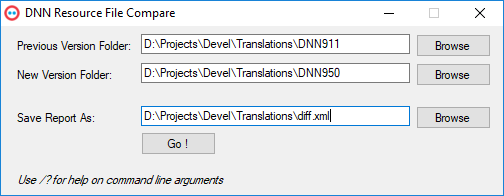
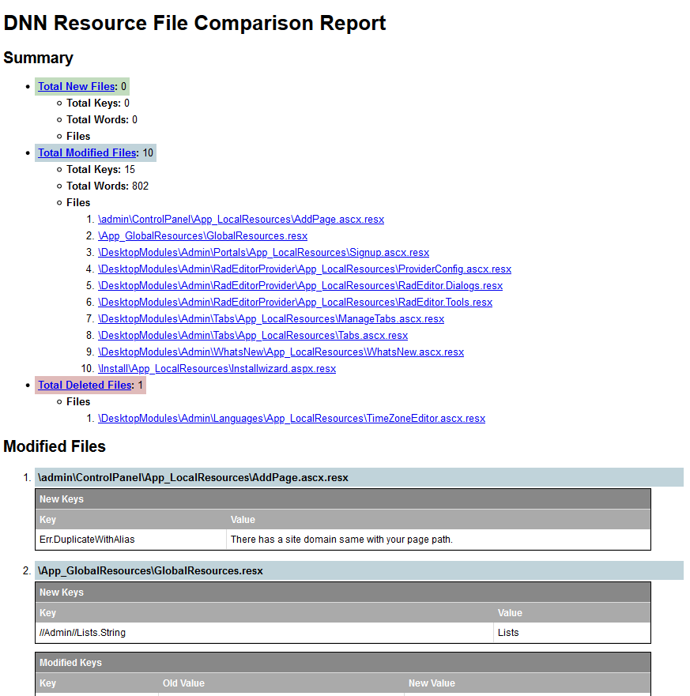

# DNNRexCompare
Compare RESX files from two different DNN versions to check differences.

This tool was developed to help DNN translators identify the changes on texts between two different DNN versions.

Using the output from the App a translator can immediatly focus on the changes for the new version and translate / adjust the new texts and provide a more accurate translation for the each new DNN release.

## Use

Just point to the root folder of two different DNN installations and provide the file name where you want to the output to be saved.

The App will check all .resx files from both folders, compare them and generate and .xml file with the differences found.

You can save the .xml to the same folder where the provided .xslt is saved and open the .xml in a browser.

The diff report will list all the files modified grouping by new, modified and deleted. For modified keys you can also see the old version and the new one.

